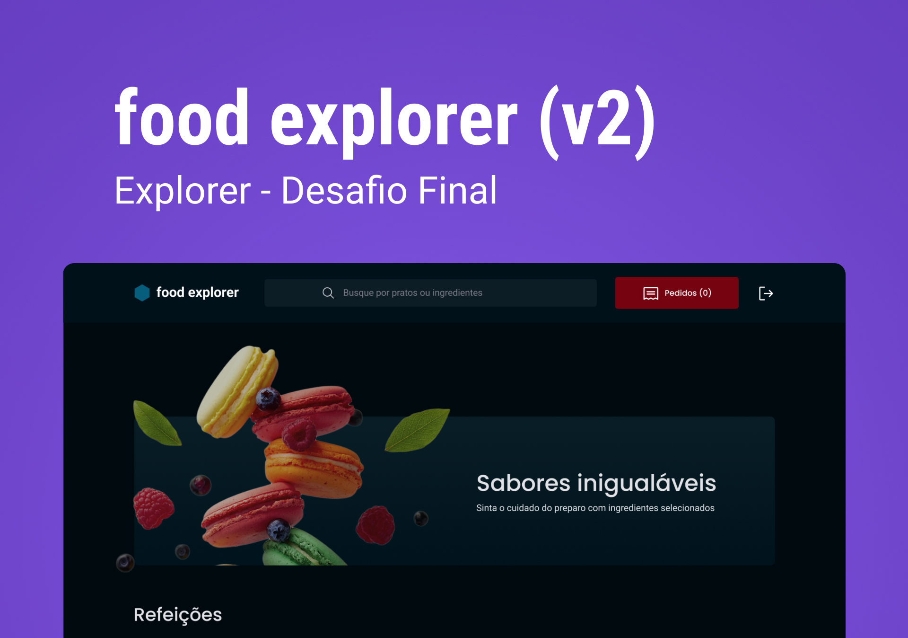

# Food Explorer - Front-end

Food Explorer é uma aplicação web de um cardápio digital para um restaurante fictício.<br>
O projeto será divido em duas partes: `Front-end` e `Back-end`

Back-end: https://github.com/JacksonJLGravino/FoodExplorer-BackEnd
<br>
Site funcionando: https://jg-foodexplorer.netlify.app/

<div align="center">
  
</div>
<br>

## Tecnologias

- [ReactJs](https://reactjs.org)
- [Node.js](https://nodejs.org/en/)
- [Javascript](https://developer.mozilla.org/pt-BR/docs/Web/JavaScript)
- [Vite](https://vitejs.dev/)
- [Axios](https://www.npmjs.com/package/axios)
- [Styled Components](https://styled-components.com/)
- [Swiper](https://swiperjs.com/)

#### 🔑 Visão do Administrador:

```bash
  e-mail: admin@admin.com
  senha: admin
```
